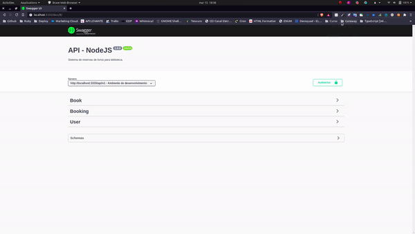
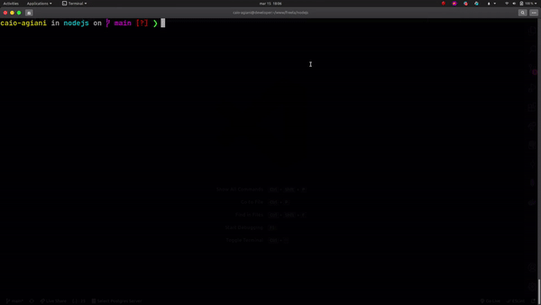

<p align="center">
  </a>
</p>

<h2 align="center">API Biblioteca | Nodejs</h2>

<div align="center">


  <p>Sistema de reservas para bibliotecas otimizarem o tempo entre Usuário & Livro.</p><br />
</div>

<div align="center" style="margin-bottom: 20px;">

  **POST** `http://localhost:3333/docs`

  <br />

  Importe todas as rotas no seu [Insomnia](https://insomnia.rest/run/?label=biblioteca-nodejs-api&uri=https://raw.githubusercontent.com/caioagiani/biblioteca-nodejs-api/master/insomnia.json).
</div>

## Baixar projeto e instalar dependências:

```bash
$ git clone git@github.com:caioagiani/biblioteca-nodejs-api.git

$ cd biblioteca-nodejs-api

$ yarn install
```

## Configurar variáveis ambiente:

```bash
$ cp .env.example .env
```

## Iniciar padrão:

```bash
$ yarn dev

# Ou iniciar com docker 🐳
$ docker-compose up
```

<div align="center" style="margin-bottom: 10px;">
  
</div>

## Testes

```bash
$ docker-compose run --rm api npm test

Starting db ... done

> nodejs@1.0.0 test /usr/src/app
> NODE_ENV=test jest --setupFiles dotenv/config --detectOpenHandles --forceExit

 PASS  __tests__/booking.test.js
 PASS  __tests__/book.test.js
 PASS  __tests__/user.test.js

Test Suites: 3 passed, 3 total
Tests:       15 passed, 15 total
Snapshots:   0 total
Time:        8.558 s
Ran all test suites.
```

## Contato

- [LinkedIn](https://www.linkedin.com/in/caioagiani/)
- caio.agiani14@gmail.com
